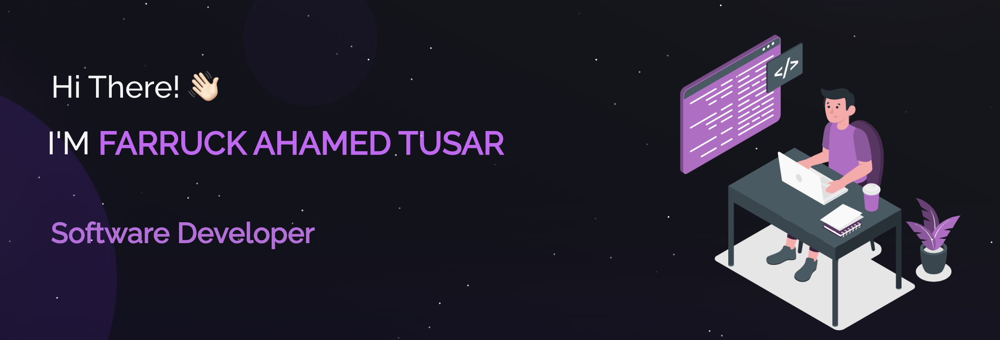

## 👨🏻‍💻 About Me:

- 🔭 I’m currently working on video processing using PySide6 and YOLO models
- 🌱 I’m currently learning ReactJS with MERN stack
- 📫 How to reach me: Find my <a href= "https://www.linkedin.com/in/farruckahamedtusar/">LinkedIn</a> profile
- ⚡ Fun fact: Wasting most of my time playing games

## 🛠️ Technologies and Tools I use:

